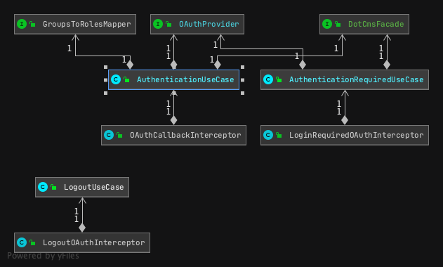

# OAuth2/OIDC SSO Plugin

This is an OSGI plugin that provides single sign-on using OAuth2/OIDC.
This intended to be a drop in replacement for the standard dotcms login, both for front end users and for backend users and effectively disables the out-of-the-box login mechanism for DotCMS.

---

# Plugin Configuration

A configuration file must be provided to configure the plugin. 
There is a default file located within the plugin bundle at `dotcms-oauth/src/main/resources/oauth-plugin-default-configuration.properties`.

If desired, a configuration file can be provided externally from the bundle in a location of your choosing (the default location is configured to be `EXTERNAL_CONFIGURATION_DIRECTORY_PATH=/mnt/dotcms/plugin-configuration/
` in a file named `oauth-plugin-external-configuration.properties`).

Furthermore, credentials and connection details that are required to connect to an Identity Provider must be provided either in a separate configuration file (`oauth-provider.properties`) or via AWS Parameter Store.
The source of credentials and connection details is also configured in the configuration file.

# Plugin Architecture

After the plugin is configured and all dependencies are injected (see PluginConfigurator.java), the control flow looks like this:

Interceptor -> UseCase -> OAuthProvider and/or DotCmsFacade and/or GroupsToRolesMapper -> UseCase -> Interceptor

Here's a UML diagram showing the same information:

## Interceptors

Interceptors are HTTP request filters running on DotCMS that listen for a specific URL pattern. If a URL matches,
the interceptor "intercepts" the request and processes it.

### com.dotcms.osgi.oauth.interceptor.BackEndLoginRequiredInterceptor
Interceptor class that "intercepts" urls that require authentication. These urls are configured in the configuration file. 
* For backend, see the property named `BACK_END_LOGIN_URLS`
* For front, see the property named `FRONT_END_LOGIN_URLS`

When one of those URLs are intercepted, the plugin will redirect a user to an SSO provider if they are not already logged in.

### com.dotcms.osgi.oauth.interceptor.OAuthCallbackInterceptor
Interceptor class that "intercepts" the configured call back url after the user is authenticated with the SSO provider.

You can change the intercepted callback url in the `oauth-plugin-default-configuration.properties`:
* `CALLBACK_URL=/app/oauth2/callback`

# How to build this example
 
To build the plugin, simply run:
 `./gradlew clean build`
 
 This will put a jar in the `build/libs` directory.

 * **To install this bundle:**
   
     Upload the bundle jars files using the dotCMS UI (*CMS Admin->Dynamic Plugins->Upload Plugin*).
 
 * **To uninstall this bundle:**
     
     Undeploy the bundle jars using the dotCMS UI (*CMS Admin->Dynamic Plugins->Undeploy*).

## Using the plugin
To use this plugin, you will need to have a developer account with the authentication providers and an application registered with those providers.  In each application, make sure you: 
* Authorize the application scopes required by the plugin
* Authorize the Callback host to receive the callback.
* Copy the application API key and API secret and set them in the config file (or in AWS Parameter Store).